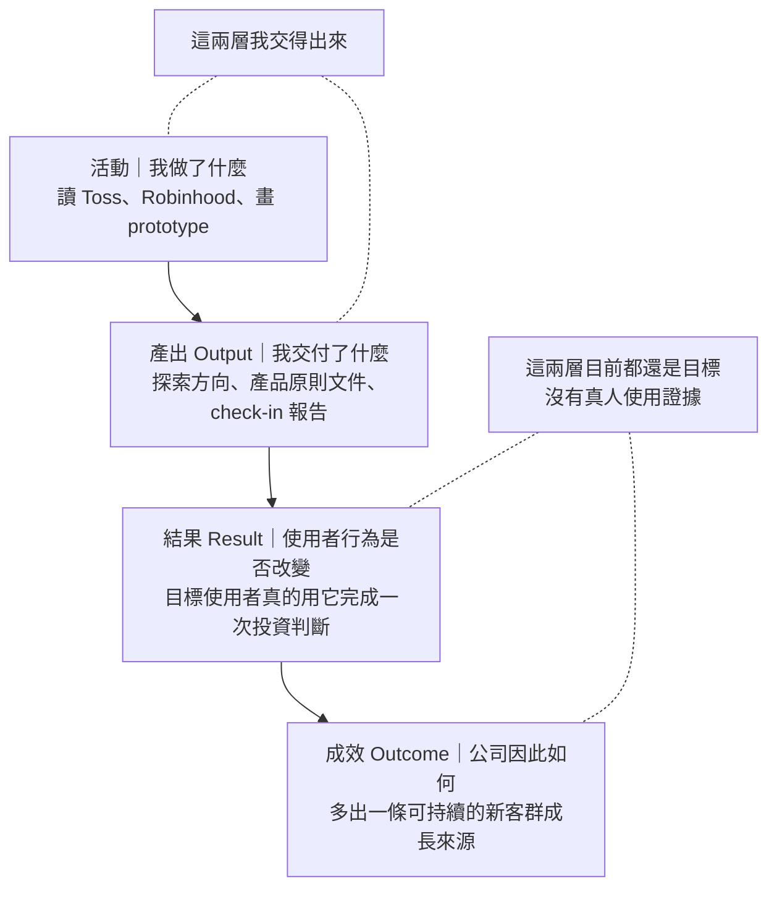
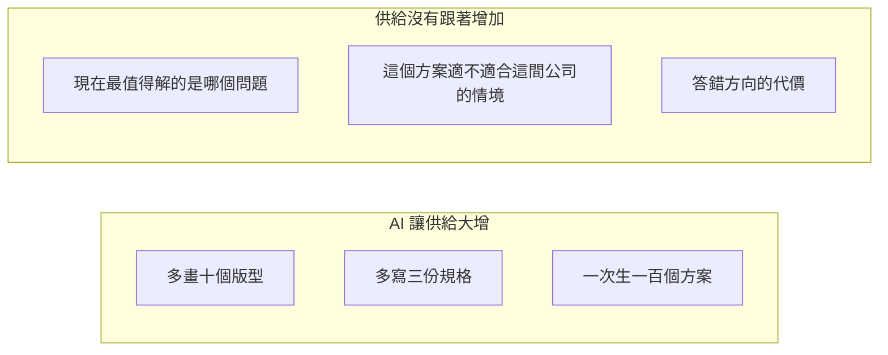

# Ownership｜我負責到因果鏈的哪一層

> 一句話：ownership 不是人格特質，是「我願意負責到因果鏈的哪一層」。

`2026-08-13`｜這是我當天的理解快照，不是通用定義。

我很常聽到 ownership，也很常聽到高階主管說「AI 出來後產出已經不是問題」。這兩句我都會複述，但一直沒真的懂：那個要我負責的「結果」到底指什麼。這篇把當時想通的定格下來，寫給之後回頭翻的自己。

我的處境：MA，目前一人負責「籌碼 K 線 Lite」這條新手產品的探索。

---

## 1. 我原本的誤解

我原本把 ownership 當成態度：主動、負責、把公司的事當自己的事。

用這個定義，我永遠對不上主管在看什麼——因為按態度算，我一直覺得自己很 own。

換一個角度就通了。它描述的不是性格，是位置：**我把責任停在因果鏈的哪一層。**

## 2. 四層，填進我自己的工作

圖裡的箭頭是「往後一層才算數」的順序，不是「做完前一層就會自動發生後一層」。第三層到第四層之間還有獲客、重複使用、留存好幾道各自要證據的關卡；一次成功的判斷不會自己長成公司成效。

我 8/12 之前的責任線停在**產出**。這是我自己的判斷，不是誰的評語：我交付了一個有邏輯的探索方向，然後把它當成交差了。

## 3. 8/12 那場 check-in，實際打在哪一層

那場會議的回饋要求我先分清楚一件事：目標使用者遇到的是**現有工具太複雜**的技術性問題，還是**本來就不靠籌碼做決策**的需求性問題。兩者會導向完全不同的產品命題。另外要求把「十倍好」講成能用時間或金錢衡量的價值差距，而不是籠統地說更簡單。

（證據邊界：錄音從討論中途開始、由兩位主管交替發言且無 speaker label，因此我只能引述回饋的內容，不能宣稱那是完整意見、也不能歸給其中某一位。完整整理見文末來源。）

這些問題我當時答不出來。而它們全部決定第三、四層會不會發生——我把力氣放在把產出做得更完整，回饋卻落在我沒有伸手過去的地方。

## 4. 為什麼 AI 之後這件事變得更嚴

這張圖只講供給，不講因果。AI 沒有讓產出變得不重要——品質、正確性、可靠交付仍然有區辨力，AI 也確實能幫我拆假設、找反例。變的是**稀缺性移位**：以前「能做、能快速交付」本身就是稀缺；現在這一段的供給暴增，於是能區分人的重量往判斷與收尾那一端挪。

我自己就是例子。8/12 卡住我的不是速度——要多畫十個版型我一天就能生出來。卡住我的是「技術性問題還是需求性問題」這個判斷；這題答錯，前面所有產出都作廢，而 AI 幫我省下的時間並不會把答錯的代價一起省掉。

## 5. 我現在做到哪一層（誠實版）

Ownership 不是「凡事自己做」，也不是「什麼都怪自己」。是：

> 即使事情跨出我的職責邊界，我仍然確保目標有人持續推進、風險有人處理、結果有人追蹤。

按這個標準看我 8/12 之後實際做的事：

- 我選擇從成熟產品的既成模式反推假設，而不是重跑一輪廣泛的從零需求探索，並且寫明我為什麼這樣選、風險是什麼。
- 我自己選了「簡單」當 Product Principle，並承認它來自我的取捨判斷，不是 Toss 或 Robinhood 幫我背書。
- 我把「尚未決定」和「仍屬未知」明寫出來，不讓未驗證的假設偷偷升級成事實。

這三件事**仍然都在產出層**。它們只證明我的產出品質變好、假設管理變乾淨，不證明我承擔了成效。我要記住這件事，因為「決策寫得夠清楚」最容易被自己誤認成「已經負責到結果」。

真正還沒有的是量尺。「十倍好」是在投入方案前判定價值差距的上游關卡；而使用、留存、公司成效各自需要另外的指標。這兩種量尺我目前都還沒定義。沒有量尺，第三、四層就只能用感覺講，而用感覺講的成效等於沒有成效。

## 6. 邊界：這句話不能無限上綱

成效責任要成立，必須同時有四件事：

1. 明確的目標與衡量方式
2. 足夠的決策權與資源
3. 對不可控因素的合理區分
4. 允許實驗失敗，而不是事後找人背鍋

缺這些的時候，「要有 ownership」也可能只是把模糊目標和經營責任往下丟。

我自己的用法：先確認手上這一題有沒有這四件事。有，就承擔到成效層；沒有，就先去把缺的那一項談出來——**去談那件事本身，也是 ownership。**

也要給自己一個出口，否則這個要求會變成不可證偽的：如果談過兩輪，目標仍然模糊、或決策權與資源仍然拿不到，那就不是我 own 得不夠，而是這件事的責任層級放錯位置，該往上升級或停下來，不是繼續往前推。

## 7. 之後回頭時，問自己這四題

1. 這件事我現在負責到第幾層？停在產出層是我選的，還是我沒意識到？
2. 我要的成效怎麼衡量？量尺定了嗎，還是我在用「更簡單」這種不能檢驗的詞？
3. 這一題最貴的錯誤是判斷錯，還是做得慢？如果是判斷錯，我把時間花在哪一邊？
4. 目標超出我的職責邊界時，我是回報卡住，還是確保它有人推進？

---

## 這篇不做什麼

- 不是 ownership 的通用定義，也不是管理學整理。是我 `2026-08-13` 的個人理解快照，論點沒有經過外部驗證。
- 不代表 Lite 的產品方向已經拍板，也不代表任何需求、採用或留存已經成立。
- 「AI 使稀缺性移位」是我自己的推論，不是我引述的任何人的原話。
- 未引用任何未公開的公司數據。

## 來源

- 8/12 check-in 的主管回饋與我後續判斷的完整整理：[0812_Check-in](https://github.com/WilliamCHIU-ETH/0812_Check-in)

## 延伸筆記

- [從 Technician 到 Entrepreneur｜這支影片打中我的地方](notes/technician-to-entrepreneur/README.md)：把「我很容易退回自己擅長的產出工作」連回市場判斷、真實互動與下一個最小練習。
